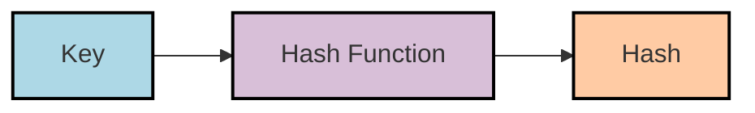
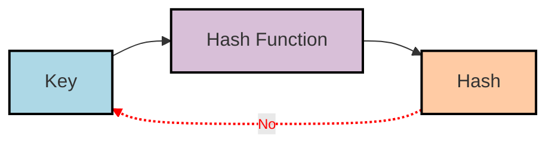
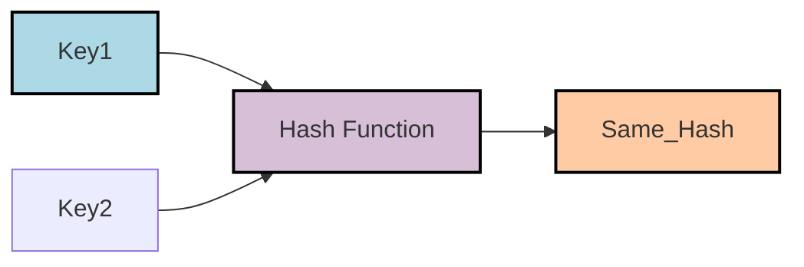

# 什么是Hash?

原文：[what is hash?](https://www.educative.io/answers/what-is-hashing)



Hash是将给定key转换为另一个值的过程。Hash函数用于根据数学算法生成新值。Hash函数的结果称为Hash值或简称Hash。

一个好的Hash函数使用单向Hash算法，或者换句话说，Hash值不能转换回原始key。



## Hash碰撞

两个key可以生成相同的Hash值。这种现象被称为碰撞。



## Hash的应用

Hash最常用于实现哈希表。哈希表以列表的形式存储键/值对，可以使用其索引访问任何元素。

由于键/值对的数量没有限制，我们可以使用Hash函数将键映射到表的大小；Hash值成为给定元素的索引。

一种简单的Hash函数是将key与表的大小进行取模运算（假设它是数字的）：

$$
index = key \bmod tableSize
$$


这将确保Hash值始终在表大小的限制内。以下是此类散列函数的代码：

```python
def hashModular(key, size):
  return key % size

list_ = [None] * 10   # List of size 10
key = 35
index = hashModular(key, len(list_))   # Fit the key into the list size
print("The index for key " + str(key) + " is " + str(index))
```

其他参考：[hashing](https://samwho.dev/hashing/)