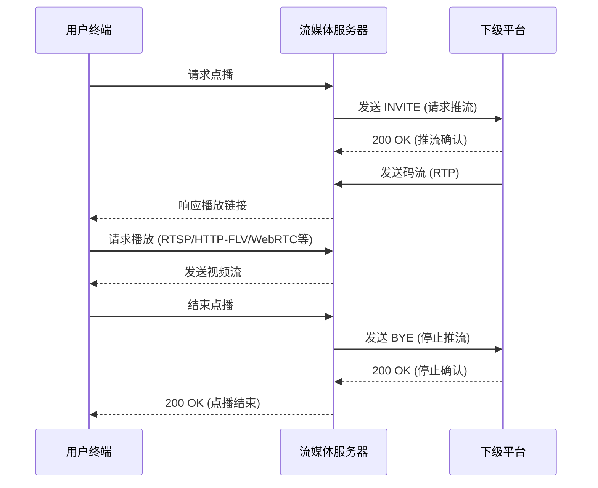

# 一、网络抓包工具


## 1. 基础配置

### 1.1 文件名称设置
- 在「文件名称」输入框填写抓包记录文件名称（示例：`test`）
- 系统将自动生成后缀为`.pcap`的抓包文件（示例：`test.pcap`）

### 1.2 开始抓包
- 点击「开始抓包」按钮立即启动抓包进程

---

## 2. 高级选项
### 2.1 自定义抓包命令（可选项）
- 支持输入符合 tcpdump 语法的自定义命令
- 常用命令示例：
  ```bash
  tcpdump -i enp14x0 host 192.168.100.53  # 抓取 指定网卡和IP的流量
  tcpdump -i eth0 port 60                 # 抓取 指定端口流量
  tcpdump -i any tcp                       # 抓取 所有TCP流量

### 2.2 超时设置（可选项）

- 通过「设置抓包超时时间」下拉菜单选择抓包持续时间（默认60秒）
- 可选范围：10-360秒
- 超时后自动停止抓包

### 2.3 远程服务器（可选项）

抓取其他服务器的网络包（默认抓取本机）

需要填写IP地址、用户名、密码。（用户名一般为root用户）

---

## 3. 记录管理
### 3.1 创建时间筛选
- 使用日期选择器指定抓包任务的创建时间范围
- 支持通过「搜索」按钮筛选记录

### 3.2 抓包记录表
- 查看历史抓包记录：
  | 字段说明 | 示例值              |
  | -------- | ------------------- |
  | 文件名称 | wen.pcap            |
  | 文件大小 | 1.15 MB             |
  | 创建时间 | 2025-03-06 14:55:04 |
  | 操作     | 下载按钮            |

---

## 4. 注意事项
1. 未填写自定义命令时，系统将使用默认抓包参数
4. 复杂过滤条件需要通过高级命令实现

# 二、日志分析


## 1. 检索界面介绍

### 1.1 搜索条件

- **相对时间**: 选择从当前时间往前的一段时间范围，例如5分钟、1小时等。
- **绝对时间**: 选择具体的时间区间进行查询。
- **关键字**: 输入要搜索的日志关键字，例如“点播”。


### 1.2 日志列表

日志列表包含以下信息：

- **时间戳**: 记录日志发生的时间。
- **日志信息**: 日志内容。（点击某一行可显示日志详细信息）
- **日志来源**: 记录日志来源。

## 2. 常见查询语法

使用以下方式进行高级日志搜索：

### 2.1 关键字匹配

```
点播
```

查询包含“点播”的所有日志。


### 2.2 精确匹配

```
"点播成功"
```

搜索包含完整短语“点播成功”的日志。


### 2.3 AND 查询

```
点播开始 AND INFO
```

同时包含“点播”和日志等级为“INFO”的日志。


### 2.4 OR 查询

```
点播 OR 播放
```

包含“点播”或“播放”的日志。

### 2.5 NOT 排除

```
点播 NOT 失败
```

包含“点播”但不包含“失败”的日志。

### 2.6 日志来源筛选

```
source:10.120.6.33
```

搜索来源IP地址为 10.120.6.33 的日志。

### 2.7 异常日志查询

```
ERROR
```


输入`ERROR` 可查询异常日志

### 2.8 SIP报文查询

输入`invite`可查询服务器发送的SIP INVITE 报文信息

通过Call-ID字段可查询到点播会话流程





## 3. 过滤和排序

- **按时间排序**: 可以点击“时间戳”列进行升序或降序排列。
- **按来源过滤**: 在搜索框中输入 `source:10.120.6.33` 仅显示该来源的日志。

# 三、监控面板

监控流媒体服务器指标数据


可查询相对时间内的监控数据


